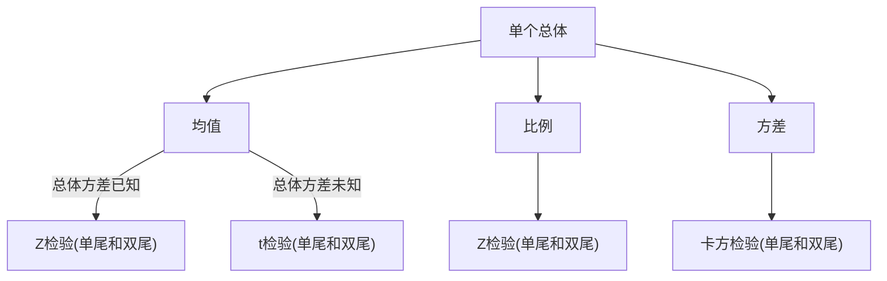
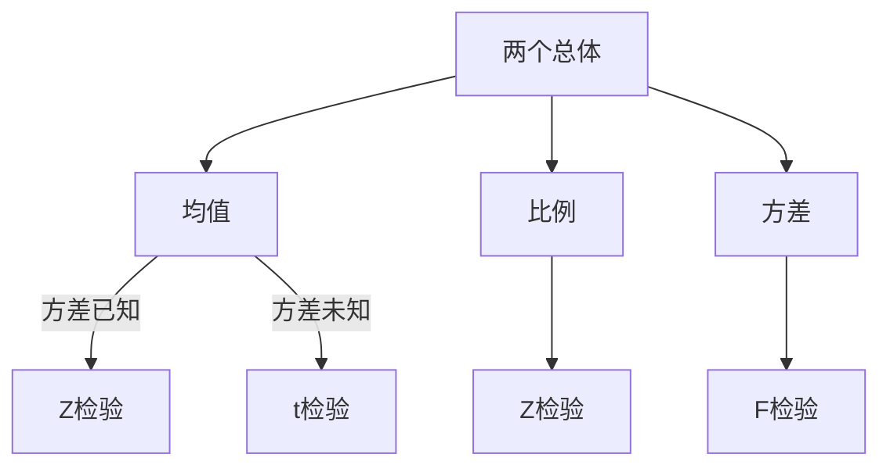

# 假设检验


## 假设检验在统计方法中的地位

 ```mermaid
graph TD;
    统计方法-->描述统计;
    统计方法-->推断统计;
    推断统计-->参数估计;
    推断统计-->假设检验;
 ```

## 学习目标

+ 了解假设检验的基本思想
+ 掌握假设检验的步骤
+ 能对实际问题做假设检验
+ 利用置信区间进行假设检验
+ 利用$p$值进行假设检验


## 假设检验的一般问题

+ 假设检验的概念
+ 假设检验的步骤
+ 假设检验中的小概率原理
+ 假设检验中的两类错误
+ 双侧检验和单侧检验


## 假设检验的概念和思想

### 什么是假设

对总体的一种看法，总体参数包括**总体均值**，**比例**，**方差**等，分析之前必需陈述

> 我认为该企业生产的零件的平均长度为4厘米


### 零假设与备择假设

+ 统计分析无法证明一个假设的真实性，它所提供的是假设存在的可能性，可能性（概率）是我们选择支持或反对假设的证据。
  + 要证明一个假设是比较困难的，比如你想证明两个东西没有差异，非常困难，你必须证明这两样东西从头到尾都没有差异
  + 但是推翻一个假设很容易，你说这两样东西没有差异，我找到一点差异，你的假设就可以被推翻。
+ 所以，在统计学上，假设都是"无罪推论"，如没有差异，没有效果，没有变化，没有关系等等，称之为零假设$(Null \ Hypothesis)$，而备择假设总是”有罪推论“。


### 什么是假设检验

+ **概念**：事先对总体参数或分布形式作出某种假设，然后利用样本信息来判断原假设是否成立
+ **类型**：
  + 参数假设检验
  + 非参数假设检验
+ **特点**：
  + 采用逻辑上的反证法
  + 依据统计上的小概率原理
+ **检验过程**：
  + 提出假设->抽取样本->做出决策


### 假设检验的步骤

1. 提出原假设和备择假设
   + 原假设$H_0$：一般有等号 $=,\le,\ge$
   + 备择假设$H_1$：一般没有等号$\neq,<,>$
   
2. 确定适当的检验统计量

   + 选择统计量的方法与参数估计相同，需考虑

     + 大样本还是小样本
     + 总体方差已知还是未知
+ 检验统计量的基本形式,例：

$$
z=\frac{\overline x -\mu_0}{\sigma/\sqrt{n}}
$$


1. 规定显著性水平$\alpha$

   + 显著性水平是一个概率值
   + 原假设为真时，拒绝原假设的概率

2. 计算检验统计量的值

3. 作出统计决策

   + 由显著性水平$\alpha$得到拒绝域的临界值$Z_\alpha$或$Z_{\alpha/2}$
   + 将检验统计量的值与临界值进行比较

### 假设检验中的小概率原理

+ 小概率：在一次试验中，一个几乎不可能发生的事件发生的概率
+ 在一次试验中小概率事件一旦发生，我们就有理由拒绝原假设
+ 小概率由研究者事先确定


### 假设检验中的两类错误（决策风险）

1. 第一类错误（弃真错误）
   + 原假设为真时拒绝原假设
   + 发生第一类错误的概率为显著性水平$\alpha$
2. 第二类错误(取伪错误)
   + 原假设为假时接受原假设
   + 第二类错误的概率为$\beta$
3. $n$固定时，$\alpha$与$\beta$不能同时减少
4. 影响$\beta$错误的因素
   + 总体参数的真值：真假难辨时$\beta$较大
   + 显著性水平$\alpha$: 当$\alpha$减少时$\beta$增大
   + 总体标准差$\sigma$:当$\sigma$增大时$\beta$增大
   + 样本容量$n$:当n减少时$\beta$增大


| **决策**    | $H_0$为真            | $H_0$为假           |
| ----------- | -------------------- | ------------------- |
| 不拒绝$H_0$ | $1-\alpha$           | 第二类错误($\beta$) |
| 拒绝$H_0$   | 第一类错误($\alpha$) | 功效$(1-\beta)$     |


### 双侧检验与单侧检验

| 假设  | 双侧检验         | 左侧检验         | 右侧检验         |
| ----- | ---------------- | ---------------- | ---------------- |
| $H_0$ | $\mu =\mu_0$     | $\mu \geq \mu_0$ | $\mu \leq \mu_0$ |
| $H_1$ | $\mu \neq \mu_0$ | $\mu < \mu_0$    | $\mu > \mu_0$    |


## 单个正态总体的参数检验



### 总体方差$\sigma^2$已知时的均值检验

#### 双尾Z检验

1. 假定条件
   + 总体服从正态分布
   + 若总体不服从正态分布，要求$n \ge 30$
2. $H_0: \mu = \mu_0; \quad H_1: \mu \ne \mu_0$
3. 使用$z$统计量

$$
z=\frac{\overline x - \mu_0}{\sigma/\sqrt n}\sim N(0,1)
$$

#### 单尾Z检验

1. 假定条件
   + 总体服从正态分布
   + 若总体不服从正态分布，要求$n \ge 30$

2. 假设有方向性
   + 左侧：$H_0:\mu \ge \mu_0\quad H_1:\mu < \mu_0$
   + 右侧：$H_0:\mu \le \mu_0\quad H_1:\mu > \mu_0$
3. 使用$z$统计量

$$
z=\frac{\overline x - \mu_0}{\sigma/\sqrt n}\sim N(0,1)
$$


### 总体方差$\sigma^2$未知时的均值检验

#### 双尾t检验和单尾t检验

1. 假定条件
   + 总体服从正态分布
2. 使用$t$统计量

$$
T=\frac{\overline x - \mu_0}{s/\sqrt n} \sim t(n-1)
$$


### 总体比例的检验

#### 双尾Z检验和单尾Z检验

1. 假定条件
   + 有两类结果
   + 总体服从二项分布
   + 可用正态分布来近似，$np>5,n(1-p)>5$

> **正态分布近似二项分布**

2. 比例检验的$z$统计量

$$
z=\frac{\hat p -p_0}{\sqrt{\frac{p_0(1-p_0)}{n}}}\sim N(0,1)
$$


### 总体方差的检验

#### 卡方检验

1. 假定条件
   + 总体服从正态分布
2. 检验统计量

$$
\chi^2 = \frac{(n-1)s^2}{\sigma^2_0} \sim \chi^2(n-1)
$$


## 两个正态总体的参数检验




### 两个独立样本的均值检验

#### $\sigma_1^2,\sigma_2^2$已知(z检验)

1. 假定条件
   + 样本互相独立
   + 总体服从正态分布
   + 若总体不服从正态分布，样本量均大于30
2. 检验统计量

$$
z=\frac{\overline x_1 - \overline x_2}{\sqrt{\frac{\sigma_1^2}{n_1}+\frac{\sigma_2^2}{n_2}}} \sim N(0,1)
$$

| 假设  | 没有差异          | 均值1$\ge$均值2     | 均值1$\le$均值2     |
| ----- | ----------------- | ------------------- | ------------------- |
| $H_0$ | $\mu_1=\mu_2$     | $\mu_1-\mu_2 \ge 0$ | $\mu_1-\mu_2 \le 0$ |
| $H_1$ | $\mu_1 \ne \mu_2$ | $\mu_1-\mu_2 < 0$   | $\mu_1-\mu_2 > 0$   |


#### $\sigma_1^2,\sigma_2^2$未知且相等（t检验）

1. 假定条件
   + 样本互相独立
   + 总体服从正态分布
   + 总体方差未知但相等，$\sigma_1^2=\sigma_2^2=\sigma^2$

2. 检验统计量

$$
T=\frac{\overline x_1 - \overline x_2}{s_p\sqrt{\frac{1}{n_1}+\frac{1}{n_2}}}
$$


### 利用置信区间进行假设检验

|                              | 双侧检验                                                     | 左侧检验                                               | 右侧检验                                               |
| ---------------------------- | ------------------------------------------------------------ | ------------------------------------------------------ | ------------------------------------------------------ |
| $H_0$                        | $\mu=\mu_0$                                                  | $\mu\ge\mu_0$                                          | $\mu\le\mu_0$                                          |
| $H_1$                        | $\mu\ne\mu_0$                                                | $\mu<\mu_0$                                            | $\mu>\mu_0$                                            |
| 单边置信区间($\sigma^2$已知) | $(\overline x-z_{\alpha/2}\frac{\sigma}{\sqrt n},\overline x+z_{\alpha/2}\frac{\sigma}{\sqrt n})$ | $(-\infty,\overline x+z_\alpha\frac{\sigma}{\sqrt n})$ | $(\overline x-z_\alpha\frac{\sigma}{\sqrt n},+\infty)$ |
| 单边置信区间($\sigma^2$未知) | $(\overline x-t_{\alpha/2}\frac{\sigma}{\sqrt n},\overline x+t_{\alpha/2}\frac{\sigma}{\sqrt n})$ | $(-\infty,\overline x+z_\alpha\frac{\sigma}{\sqrt n})$ | $(\overline x-t_\alpha\frac{\sigma}{\sqrt n},+\infty)$ |
| 决策                         | 若$\mu_0$在置信区间外，则拒绝$H_0$                           | 若$\mu_0$在置信区间外，则拒绝$H_0$                     | 若$\mu_0$在置信区间外，则拒绝$H_0$                     |


### 利用$p$值进行假设检验

#### 什么是$p$值

1. $p$值是一个概率值
2. 若原假设为真，$p$值是观测到的样本均值不同于实测值的概率
3. $p$值被称为观察到的（或实测的）显著性水平
   + $H_0$能被拒绝的$\alpha$的最小值

#### 利用$p$值进行决策

+ 若$p<\alpha$,则拒绝$H_0$
+ 若$p\ge\alpha$,则不拒绝$H_0$

#### 使用$p$值法时的注意点

1. $p$值是假定原假设为真时所得到的样本观察结果或更极端结果出现的概率，并不是原假设为真的概率的估计值
2. $Jeffreys-Lindley$ 悖论：当样本容量很大时，由$p$值检验几乎总是得出拒绝原假设的结论。
   + 因此当样本容量很大时$p$值并不太适用
3. $p$值只能回答两总体参数是否有显著性差异，不能反应两者的差异程度。一般要把$p$值和区间估计的结果相结合


