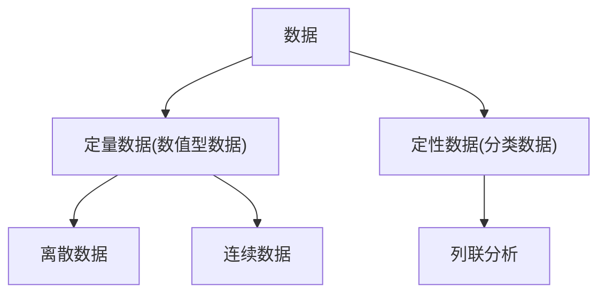

# 分类数据分析

[toc]

## 主要内容

1. 分类数据与$\chi^2$统计量
2. 拟合优度检验
3. 列联分析
4. 列联分析中应注意的问题

## 数据类型与列联分析

## 分类数据与$\chi^2$统计量

**分类数据**

+ 分类变量结果表现为类别
  + 例如：性别
+ 各类别用符号或数字代码来测度
+ 使用定类或定序尺度
  + 你是否吸烟？
    + 1.是 2.否
  + 你赞成or反对这一方案？
    + 1.赞成 2.反对
+ 对于分类数据的描述和分析通常使用列联表
+ 可使用$\chi^2$检验

**卡方统计量**
$$
\chi^2=\sum_i\frac{(f_i^{(o)}-f_i^{(e)})^2}{f_i^{(e)}}
$$

## 拟合优度检验(Goodness-of-fit Test)

**定义**：依据总体分布状况，计算出分类变量中各类别的期望频数，与分布的观察频数进行对比，判断期望频数与观察频数是否有显著差异

### 卡方检验是一个右侧检验

因为卡方检验的$H_0$是: $\chi^2=0$, 而卡方分布是一群标准正态的平方和，它是非负的$(\chi^2>0)$,所以拒绝域只有右侧一边有，所以是右侧检验

## 列联分析

### 列联表

+ 两个以上的变量进行进行交叉分类的频数分布表
+ 行变量的类别用$r$表示，$r_i$表示第$i$个类别
+ 列变量的类别用$c$表示，$c_j$表示第$j$个类别
+ 每种组合的观察频数用$f_{ij}^{(o)}$表示
+ 表中列出了行变量和列表量的所有可能的组合，所以称为列联表
+ 一个$r$行$c$列的列联表称为$r\times c $ 列联表

|         | $j=1$          | $j=2$          | $\dots$ | 合计    |
| ------- | -------------- | -------------- | ------- | ------- |
| $i=1$   | $f_{11}^{(o)}$ | $f_{12}^{(o)}$ | $\dots$ | $r_1$   |
| $i=2$   | $f_{21}^{(o)}$ | $f_{22}^{(o)}$ | $\dots$ | $r_2$   |
| $\dots$ | $\dots$        | $\dots$        | $\dots$ | $\dots$ |
| 合计    | $c_1$          | $c_2$          | $\dots$ | n       |

### 期望频数

$$
f_{ij}^{(e)}=\frac{r_i c_j}{n}
$$

### $\chi^2$统计量

检验列联表中变量之间是否存在显著性差异，或者检验变量之间是否独立

计算公式
$$
\chi^2=\sum_{i=1}^{r}\sum_{j=1}^{c}\frac{(f_{ij}^{(0)}-f_{ij}^{(e)})^2}{f_{ij}^{(e)}}\\
df=(r-1)(c-1)
$$

### 检验

1. 提出假设

   + **拟合优度检验**：检验列联表中目标变量之间是否存在显著性差异
     + $H_0:P_1=P_2=\dots=P_j$
     + $H_1:P_1,P_2,\dots,P_j$不全相等
   + **独立性检验**：检验列联表中的行变量与列变量之间是否独立
     + $H_0:$ 行变量与列变量独立
     + $H_1:$ 行变量与列变量不独立

2. 决策

   + 根据显著性水平$\alpha$和自由度$(r-1)(c-1)$查出临界值$\chi^2_\alpha$

   + 若$\chi^2 \ge \chi^2_\alpha$,拒绝$H_0$;
   + 若$\chi^2<\chi^2_\alpha$,接受$H_0$

### 列联分析中应注意的问题

+ 条件百分表的方向
  + 通常将自变量放在列的位置，将因变量放在行的位置
  + 如果因变量在样本中的分布和在总体中的分布不同时，可以进行调整
+ 卡方分布的期望值准则
  + 如果是普通四格表，每个单元的期望频数必须$\ge5$
  + 如果是$r\times c$列联表，$20\%$以上的单元期望频数$<5$时，不能使用卡方检验
  + 原因：如果期望值过小,会造成$\frac{(f_i^{(o)}-f_i^{(e)})^2}{f_i^{(e)}}$不适当的增大，造成对$\chi^2$的高估，导致不适当地拒绝原假设的结论